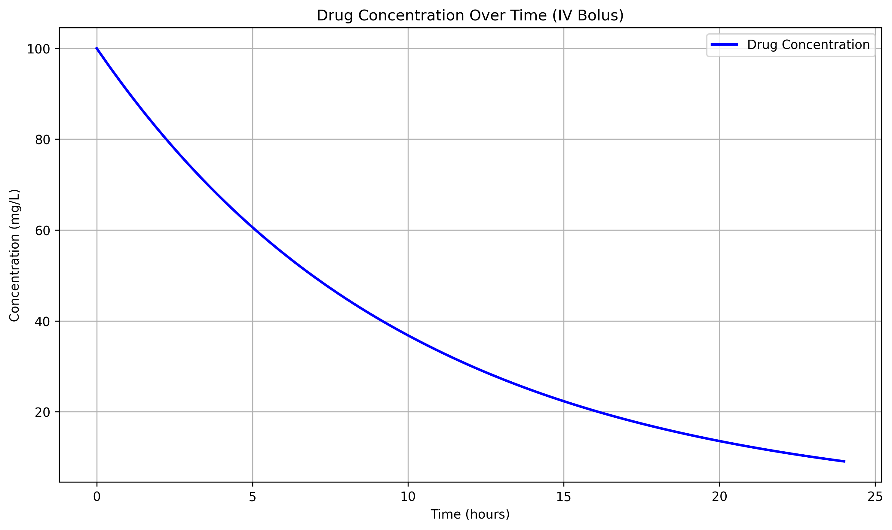

# Drug Concentration Simulation: Pharmacokinetic Modeling with Python

A computational model simulating first-order drug elimination kinetics using ordinary differential equations (ODEs). Designed for biomedical applications in pharmacokinetics and drug dosing analysis.



## Biomedical Relevance
Models **drug metabolism** using principles from pharmacokinetics:
- Simulates IV bolus administration
- Calculates elimination kinetics using rate constants
- Visualizes time-concentration profiles for dosing regimen analysis

Key concepts:
- **First-order elimination**: Common for most drugs at therapeutic doses
- **Half-life calculation**: Directly derived from elimination rate constant
- **Therapeutic window**: Critical for determining dosing intervals

## Tools & Libraries
- **Core**
  - `numpy`: Numerical operations & array handling
  - `scipy.integrate.solve_ivp`: ODE solver for pharmacokinetic modeling
  - `matplotlib`: Publication-quality visualization

- **Development**
  - VS Code
  - Git/GitHub

## Features
- **ODE-based pharmacokinetic modeling**
- Customizable parameters:
  - Elimination rate constant (`k_elim`)
  - Initial dose
  - Simulation duration
- Automated plot generation
- Scalable architecture for:
  - Multi-compartment models
  - Repeated dosing regimens
  - Patient-specific parameter optimization

## Getting Started

### Prerequisites
- Python 3.8+
- pip package manager

### Installation
1. Clone repository:
   ```bash
   git clone https://github.com/your-username/Drug-Concentration-Model.git
   cd Drug-Concentration-Model
   ```

   ##ADD##